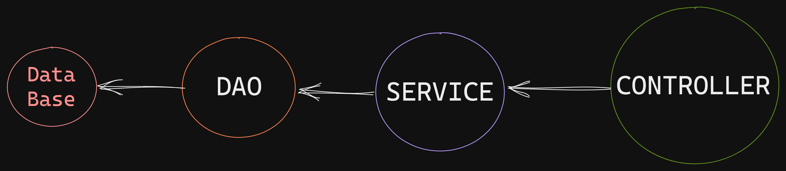

## Taxi service

This project implements a taxi service with login and registration.
Using n-tier 3-layer architecture, also using the design principle SOLID and OOP.
The application has such features as:
1. **add and remove:**
    * drivers
    * cars
    * manufacturer

2. **display information:**
    * drivers
    * cars
    * manufacturers
3. **register the driver on the website and login**

## Project structure

Architecture consists of 3 layers

* **DAO** (work with the database)
* **SERVICES** (routing logic)
* **CONTROLLER** (remote control)

## Technology

* Java 11
* Maven
* Apache Tomcat 
* MySQL - version 8.0
* JDBC
* Servlet
* JSTL
* JSP

## What you need to do to start the project

1. Tomcat
    * install Tomcat
    * configure Tomcat

2. MySQL
    * Run script from _resources/init_db.sql file_ to get all tables.
    * In _/util/ConnectionUtil.java_, change the **URL**, **MYSQL_DRIVER**, **USERNAME** and **PASSWORD** properties to those
      which you specified when installing MySQL.

3. Сhange absolute path to logging file in `resources/log4j2.xml`.
   
4. After starting tomcat, go to _http://localhost:[port]_ that you specified when configuring Tomcat,
  click "Register",
  to add a new driver.
   